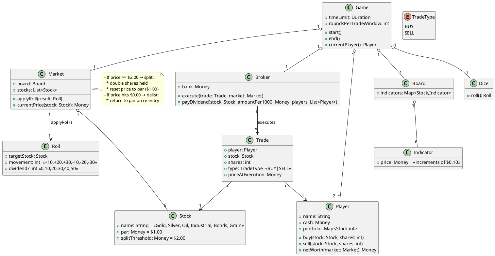
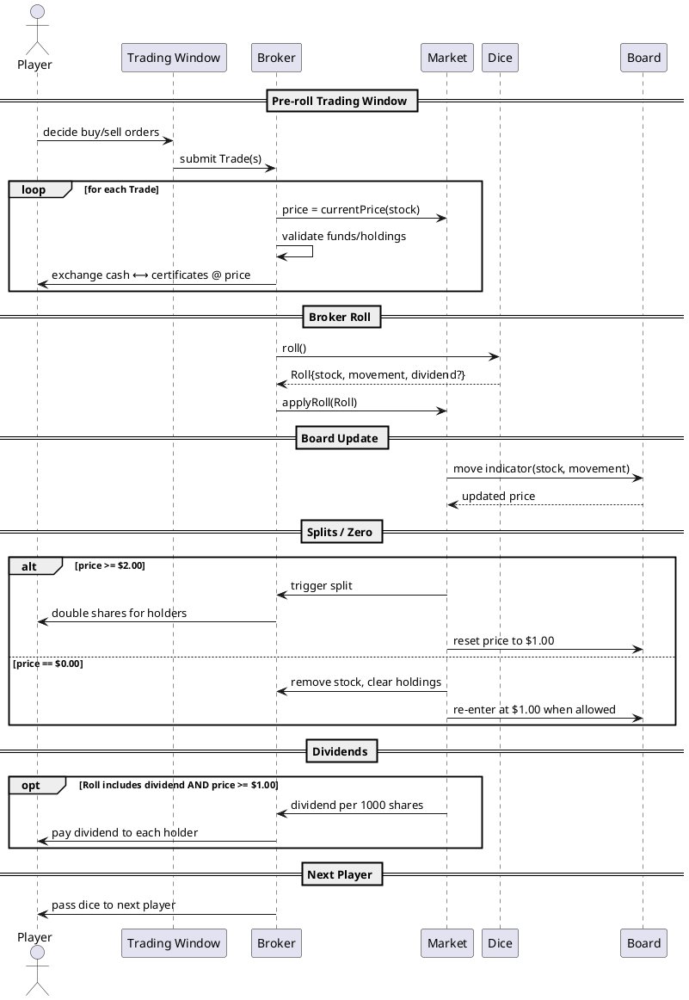
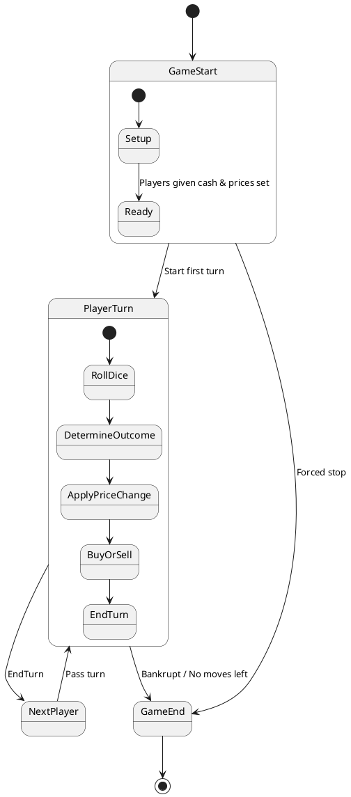

# Stock Ticker
> A board game about the real-time changes and activities of the market system.
> Resources: Cash
> Commodities: Industrial, Bonds, Oil, Gold, Silver

- <a href=stocktickerrules.pdf> Rules </a>
- <a href=sample> GUI Sample </a>

## Class Diagram

## Sequence Diagram

## Activity Diagram

## Physical Board Game
