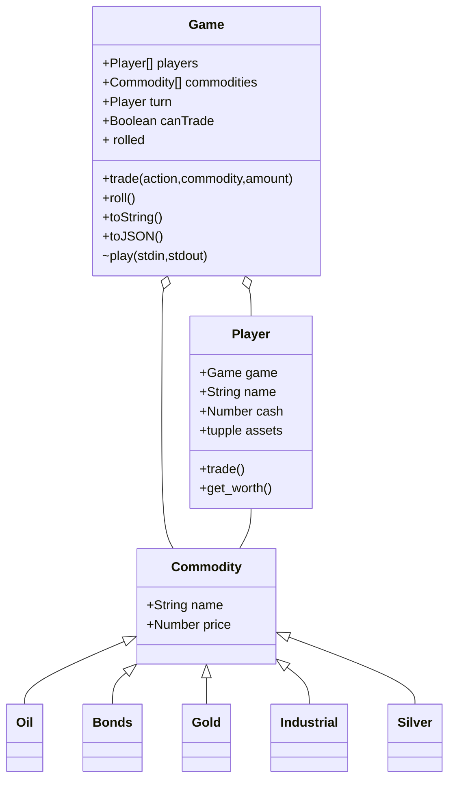

# Stock Ticker
> A board game about the real-time changes and activities of the market system.
> Resources: Cash
> Commodities: Industrial, Bonds, Oil, Gold, Silver

## Class Diagram


## Game Play Flowchart
```mermaid
    graph TD
        NumPlayers[/# Players/] --> StartGame
        PlayerNames[/Player Names/] --> StartGame
        StartGame --> DistributeCash
        DistributeCash --> NextPlayer
        NextPlayer--> MakeTrade1{Make Trade?}
        MakeTrade1 --> |no| RollDice
        MakeTrade1 --> |yes| MakeTrade1
        RollDice --> WasUpDown{Was Down}
        WasUpDown --> |yes| NextPlayer
        WasUpDown --> |no| RollDice
  ```

## Game Play State Diagram
  ```mermaid
    stateDiagram
        [*] --> Waiting
        Waiting --> NumPlayers
        NumPlayers --> PlayerNames
        PlayerNames --> PlayerTurn
        PlayerTurn --> CanTrade
        CanTrade --> Trade
        Trade--> CanTrade
        CanTrade --> CanRoll
        CanRoll --> Roll
        Roll --> CanRoll
        CanRoll --> PlayerTurn
        PlayerTurn --> Quit
        Quit --> [*]
```